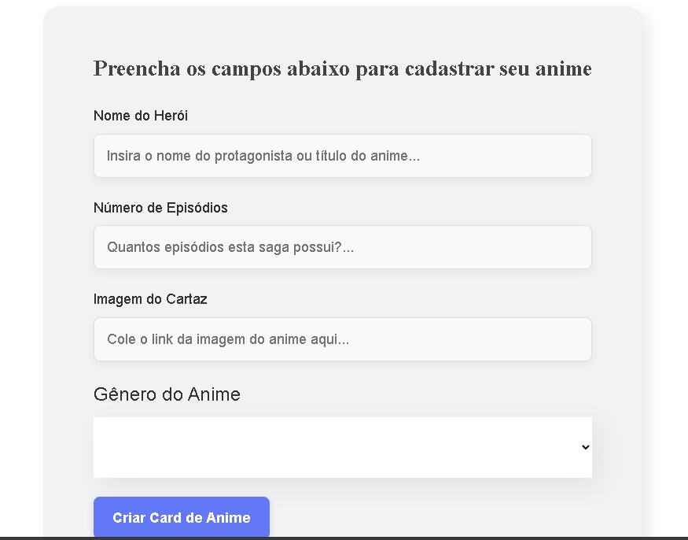

# Projeto de Cadastro de Animes

Este é um projeto React para cadastrar e organizar animes por gênero, permitindo a criação de cards personalizados que incluem o nome, número de episódios, imagem de cartaz e gênero. O projeto também possibilita a modificação das cores dos gêneros e possui um rodapé com links para redes sociais.

## Funcionalidades

- Adicionar, excluir e listar animes.
- Alterar a cor de fundo de cada gênero de anime.
- Rodapé com links para GitHub, LinkedIn e redes sociais.

## Estrutura do Projeto

### Componentes Principais

- **`App.js`**: Gerencia o estado global dos animes e das operações de adicionar e excluir.
- **`Banner`**: Exibe uma imagem principal.
- **`Formulario`**: Permite o cadastro de animes.
- **`Botao`**: Botão estilizado para envio do formulário.
- **`CampoTexto`**: Campos de texto do formulário.
- **`ListaSuspensa`**: Seleção do gênero do anime.
- **`Time`**: Exibe animes por gênero com possibilidade de mudança de cor.
- **`Colaborador`**: Card de cada anime com informações e botão de exclusão.
- **`Rodape`**: Links para redes sociais.

## Tecnologias Utilizadas

- React
- CSS
- React Icons
- UUID
- Hex-to-Rgba

## Como Clonar e Rodar o Projeto

1. Clone o repositório: `git clone https://github.com/EdsonJr21/Cadastro-de-Animes.git`
2. Navegue até o diretório: `cd Cadastro-de-Animes`
3. Instale as dependências: `npm install`
4. Inicie o projeto: `npm start`